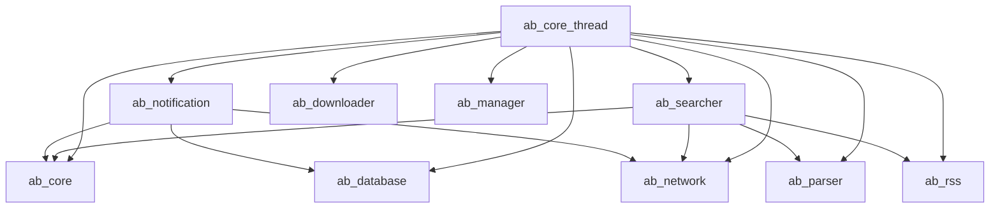

# Stage 9: ab-notification + ab-searcher + ab-core-thread

## Overview

Three crates completing the background engine:

| Crate | Purpose | Depends On |
|---|---|---|
| `ab-notification` | 8 push providers + manager | ab-core, ab-network, ab-database |
| `ab-searcher` | Torrent keyword search + TMDB poster fetch | ab-core, ab-network, ab-parser, ab-rss |
| `ab-core-thread` | Program lifecycle + 4 background loops + offset scan | everything above |

## ab-notification

### Files

```
ab-notification/
  Cargo.toml
  src/
    lib.rs
    provider.rs          — NotificationProvider trait + base
    manager.rs           — NotificationManager
    providers/
      mod.rs             — PROVIDER_REGISTRY
      telegram.rs
      discord.rs
      bark.rs
      server_chan.rs
      wecom.rs
      gotify.rs
      pushover.rs
      webhook.rs
```

### NotificationProvider trait (provider.rs)

```rust
#[async_trait]
pub trait NotificationProvider: Send + Sync {
    async fn send(&self, notification: &Notification) -> Result<bool>;
    async fn test(&self) -> Result<(bool, String)>;
    fn format_message(&self, notify: &Notification) -> String;
}
```

- `format_message` default impl (same as Python `_format_message`)
- Each provider holds its own config + constructs URLs in `new()`
- HTTP calls via `NetworkClient` from ab-network (the `RequestContent` equivalent)
- Providers implement `post_data(url, json_body)` using `NetworkClient.post_json`

### ProviderConfig model (in ab-core, already exists)

Fields from Python `NotificationProvider` config:
```rust
pub struct NotificationProviderConfig {
    pub r#type: String,          // "telegram", "discord", etc.
    pub enabled: bool,
    pub token: Option<String>,
    pub chat_id: Option<String>,
    pub webhook_url: Option<String>,
    pub server_url: Option<String>,
    pub device_key: Option<String>,
    pub user_key: Option<String>,
    pub api_token: Option<String>,
    pub template: Option<String>,
    pub url: Option<String>,
}
```

Note: the `type` field is a Rust keyword — use `#[serde(rename = "type")]` on a field named `provider_type` or `kind`.

### Provider implementations

All follow same pattern as Python originals. Key differences:

| Provider | Python URL Construction | Rust Notes |
|---|---|---|
| Telegram | `bot{token}/sendPhoto`, `bot{token}/sendMessage` | Two URLs, sendPhoto if poster available |
| Discord | `webhook_url` | Embed with title/description/color/thumbnail |
| Bark | `server_url/push` or `api.day.app/push` | `device_key` or legacy `token` |
| ServerChan | `sctapi.ftqq.com/{token}.send` | title + desp fields |
| Wecom | `webhook_url` or `chat_id` | news type, `key` in body not header |
| Gotify | `server_url/message?token={token}` | extras for markdown + bigImageUrl |
| Pushover | `api.pushover.net/1/messages.json` | token + user fields, poster as url |
| Webhook | Customizable JSON template with `{{title}}`/`{{season}}`/`{{episode}}`/`{{poster_url}}` | Must compile and cache template |

### PROVIDER_REGISTRY (providers/mod.rs)

```rust
use once_cell::sync::Lazy;
use std::collections::HashMap;

pub static PROVIDER_REGISTRY: Lazy<HashMap<&'static str, fn(ProviderConfig) -> Box<dyn NotificationProvider>>> =
    Lazy::new(|| {
        let mut m: HashMap<&str, fn(ProviderConfig) -> Box<dyn NotificationProvider>> = HashMap::new();
        m.insert("telegram", |c| Box::new(TelegramProvider::new(c)));
        m.insert("discord", |c| Box::new(DiscordProvider::new(c)));
        // ... etc
        m
    });
```

Alternative: use an enum `ProviderKind` with a match dispatch instead of dynamic dispatch. Dynamic dispatch is simpler and matches Python's duck-typing pattern.

### NotificationManager (manager.rs)

```rust
pub struct NotificationManager {
    providers: Vec<Box<dyn NotificationProvider>>,
}

impl NotificationManager {
    pub fn new() -> Self;
    fn load_providers(&mut self);  // from settings.notification.providers
    pub async fn send_all(&self, notification: &Notification);
    pub async fn test_provider(&self, index: usize) -> Result<(bool, String)>;
    pub async fn test_provider_config(config: &NotificationProviderConfig) -> Result<(bool, String)>;
}
```

- `send_all`: fetch poster from DB if missing, then `join_all` sends
- `_get_poster` uses `Database` to `search_official_title` for poster_link
- `test_provider_config` is `async` static method (no instance needed)
- `__len__` → `impl len() -> usize`

### Notification model (in ab-core models)

Already defined in Stage 1/2:
```rust
pub struct Notification {
    pub official_title: String,
    pub season: i32,
    pub episode: i32,        // Python stores episode as int
    pub poster_path: Option<String>,
}
```

### API stubs (moved from ab-api backref to here)

The notification API endpoints (`POST /notification/test`, `POST /notification/test-config`) were defined in Stage 8 as stubs. They remain in ab-api but now call real `NotificationManager` logic instead of returning mock responses.

## ab-searcher

### Files

```
ab-searcher/
  Cargo.toml
  src/
    lib.rs
    provider.rs      — search_url + SEARCH_CONFIG
    searcher.rs      — SearchTorrent
```

This crate depends on:
- ab-core (models: Bangumi, RSSItem, Torrent)
- ab-network (NetworkClient for HTTP)
- ab-parser (tmdb_parser)
- ab-rss (RSSAnalyser — `get_torrents`, `torrent_to_data`)

### SearchProvider (provider.rs)

```rust
use std::collections::HashMap;
use once_cell::sync::Lazy;

static DEFAULT_PROVIDERS: Lazy<HashMap<&'static str, &'static str>> = Lazy::new(|| {
    let mut m = HashMap::new();
    m.insert("mikan", "https://mikanani.me/RSS/Search?searchstr=%s");
    m.insert("nyaa", "https://nyaa.si/?page=rss&q=%s&c=0_0&f=0");
    m.insert("dmhy", "http://dmhy.org/topics/rss/rss.xml?keyword=%s");
    m
});

pub fn load_providers() -> HashMap<String, String>;  // from config/search_provider.json
pub fn save_providers(providers: &HashMap<String, String>);
pub fn get_providers() -> HashMap<String, String>;

pub fn search_url(site: &str, keywords: &[String]) -> Result<RSSItem>;
```

- `search_url` replaces `%s` with joined keywords (non-word chars → `+`)
- Returns RSSItem with `url`, `aggregate: false`, `parser` set to "mikan" for mikan, "tmdb" otherwise
- Config file: `config/search_provider.json` (same pattern as Python)

### SearchTorrent (searcher.rs)

Python uses multiple inheritance: `SearchTorrent(RequestContent, RSSAnalyser)`. In Rust we use composition:

```rust
pub struct SearchTorrent {
    client: NetworkClient,
    rss_analyser: RSSAnalyser,
    poster_cache: Mutex<HashMap<String, Option<String>>>,
}
```

**Methods:**

```rust
impl SearchTorrent {
    pub fn new(client: NetworkClient) -> Self;

    /// Fetch torrents from RSS URL (delegates to RSSAnalyser)
    pub async fn search_torrents(&self, rss_item: &RSSItem) -> Result<Vec<Torrent>>;

    /// SSE generator: yields JSON for each matching bangumi
    pub async fn analyse_keyword(
        &self,
        keywords: &[String],
        site: &str,
        limit: usize,
    ) -> impl Stream<Item = String>;

    /// Build a search URL from bangumi fields (group_name, title_raw, etc.)
    pub fn special_url(&self, data: &Bangumi, site: &str) -> RSSItem;

    /// Search for all seasons of a bangumi
    pub async fn search_season(&self, data: &Bangumi, site: &str) -> Result<Vec<Torrent>>;

    /// Fetch TMDB poster with cache
    async fn fetch_tmdb_poster(&self, title: &str) -> Option<String>;
}
```

**SEARCH_KEY fields:**
```rust
const SEARCH_KEY: &[&str] = &[
    "group_name", "title_raw", "season_raw", "subtitle", "source", "dpi",
];
```

- `analyse_keyword` returns a `Stream<Item = String>` (using `tokio_stream` or `futures::Stream`)
  - Each yield is a JSON string of `Bangumi.dict()` (serde_json::to_string)
  - Uses `torrent_to_data` from RSSAnalyser to parse each torrent into Bangumi
  - Checks `special_url` dedup via `exist_list`
  - Fetches TMDB poster if missing from bangumi result
  - Limits to `limit` results (default 100, MCP caps at 20)

- `search_season` filters results by `title_raw` substring match

- `fetch_tmdb_poster` checks `_poster_cache` first, then calls `tmdb_parser` with `test=True`

### API integration

The search API endpoints (`/search/bangumi` SSE, `/search/provider`, `/search/provider/config`) were stubbed in Stage 8. Now they wire to real `SearchTorrent` and `search_provider` functions.

## ab-core-thread

### Files

```
ab-core-thread/
  Cargo.toml
  src/
    lib.rs                    — re-exports
    status.rs                 — ProgramStatus
    rss_thread.rs             — RSSThread
    rename_thread.rs          — RenameThread
    offset_scanner.rs         — OffsetScanner + OffsetScanThread
    calendar_thread.rs        — CalendarRefreshThread
    program.rs                — Program (assembles everything)
```

This crate is the runtime orchestrator. It depends on all crates built so far:
- ab-core, ab-database, ab-network, ab-parser, ab-downloader
- ab-rss, ab-manager, ab-notification, ab-searcher

### ProgramStatus (status.rs)

Tracks program state. Replaces Python's `Checker` + `ProgramStatus` mixin:

```rust
pub struct ProgramStatus {
    // Checker methods (static)
    // ProgramStatus fields
    stop_event: Option<tokio::sync::watch::Sender<bool>>,
    downloader_status: Arc<AtomicBool>,
    downloader_last_check: Arc<AtomicI64>,  // timestamp
    tasks_started: Arc<AtomicBool>,
}

impl ProgramStatus {
    pub fn check_renamer() -> bool;        // settings.bangumi_manage.enable
    pub fn check_analyser() -> bool;       // settings.rss_parser.enable
    pub fn check_first_run() -> bool;      // config/.setup_complete exists
    pub fn check_version() -> (bool, Option<i32>);  // semver check
    pub fn check_database() -> bool;       // data/data.db exists
    pub fn check_img_cache() -> bool;      // data/posters exists
    pub async fn check_downloader(&self) -> bool;  // HTTP check + DownloadClient

    pub fn is_running(&self) -> bool;
    pub fn first_run(&self) -> bool;
    pub fn legacy_data(&self) -> bool;     // LEGACY_DATA_PATH exists
    pub fn version_update(&self) -> (bool, Option<i32>);
}
```

Key differences from Python:
- `check_downloader` uses `NetworkClient` instead of raw httpx + duplicate client
- `check_first_run` checks `.setup_complete` marker — if it exists, not first run; otherwise compares config to defaults
- `check_version` reads/writes `config/version` file, uses `semver` crate
- `check_downloader` has TTL caching (60s) via `downloader_last_check` + `DOWNLOADER_STATUS_TTL`
- Mock downloader (type == "mock") always returns true

### Thread trait (background loop pattern)

All 4 threads share the same structure. Abstract into a helper or macro:

```rust
#[async_trait]
pub trait BackgroundThread: Send + Sync {
    fn name(&self) -> &'static str;
    fn interval(&self) -> Option<Duration>;  // None = no sleep, run once
    async fn iteration(&self) -> Result<()>;  // one loop iteration

    // Default implementation for start/stop:
    fn start(&self, shutdown: watch::Receiver<bool>) -> JoinHandle<()>;
}
```

Each concrete thread wraps this pattern. For simplicity, we'll implement each thread directly.

### RSSThread (rss_thread.rs)

```rust
const RSS_INTERVAL: Duration = Duration::from_secs(300);  // settings.program.rss_time

pub struct RSSThread {
    status: Arc<ProgramStatus>,
}

impl RSSThread {
    pub fn new(status: Arc<ProgramStatus>) -> Self;
    pub async fn run(&self, mut shutdown: watch::Receiver<bool>);
}
```

Loop body (matches Python `rss_loop`):
1. Create `DownloadClient` (via `async with` pattern — Acquire/Release)
2. Create `RSSEngine` (sync)
3. `engine.rss.search_aggregate()` — get RSS entries
4. `analyser.rss_to_data(rss, engine)` — parse RSS to Bangumi data
5. `engine.refresh_rss(client)` — download + add torrents
6. If `settings.bangumi_manage.eps_complete` → `eps_complete()`
7. Sleep for `RSS_INTERVAL` (or until shutdown signal)

### RenameThread (rename_thread.rs)

```rust
const RENAME_INTERVAL: Duration = Duration::from_secs(300);  // settings.program.rename_time

pub struct RenameThread {
    status: Arc<ProgramStatus>,
}

impl RenameThread {
    pub fn new(status: Arc<ProgramStatus>) -> Self;
    pub async fn run(&self, mut shutdown: watch::Receiver<bool>);
}
```

Loop body (matches Python `rename_loop`):
1. Create `Renamer` (via `async with`)
2. `renamer.rename()` → renamed infos
3. If `settings.notification.enable` + infos exist:
   - Create `NotificationManager`
   - `manager.send_all(info)` for each renamed item
4. Sleep for `RENAME_INTERVAL`

### OffsetScanner (offset_scanner.rs)

```rust
pub struct OffsetScanner {
    client: NetworkClient,
}

impl OffsetScanner {
    pub async fn scan_all(&self) -> Result<usize>;
    async fn check_bangumi(&self, bangumi: &Bangumi) -> Result<bool>;
    pub async fn check_single(&self, bangumi_id: i64) -> Result<bool>;
}
```

Logic (matches Python):
1. Query DB for active bangumi via `bangumi.get_active_for_scan()`
2. For each:
   - Skip if `needs_review`, `season_offset != 0`, or `episode_offset != 0`
   - Call `tmdb_parser(bangumi.official_title, language)`
   - Call `detect_offset_mismatch(season, episode, tmdb_info)`
   - If suggestion with high/medium confidence, set `needs_review` in DB
3. Return count of flagged items

### OffsetScanThread

```rust
pub struct OffsetScanThread {
    scanner: OffsetScanner,
    status: Arc<ProgramStatus>,
}

impl OffsetScanThread {
    pub fn new(status: Arc<ProgramStatus>, client: NetworkClient) -> Self;
    pub async fn run(&self, mut shutdown: watch::Receiver<bool>);
}
```

- Initial delay: 60s
- Interval: 6 hours (OFFSET_SCAN_INTERVAL)
- Logs flagged count

### CalendarRefreshThread (calendar_thread.rs)

```rust
pub struct CalendarRefreshThread {
    status: Arc<ProgramStatus>,
}

impl CalendarRefreshThread {
    pub fn new(status: Arc<ProgramStatus>) -> Self;
    pub async fn run(&self, mut shutdown: watch::Receiver<bool>);
}
```

- Initial delay: 120s
- Interval: 24 hours (CALENDAR_REFRESH_INTERVAL)
- Creates `TorrentManager`, calls `manager.refresh_calendar()`

### Program (program.rs)

The top-level orchestrator. Python uses MI (4 thread classes), Rust uses composition:

```rust
pub struct Program {
    status: Arc<ProgramStatus>,
    shutdown_tx: Option<watch::Sender<bool>>,
    handles: Vec<JoinHandle<()>>,
}

impl Program {
    pub fn new() -> Self;

    pub async fn startup(&mut self) -> Result<ResponseModel>;
    pub async fn start(&mut self) -> Result<ResponseModel>;
    pub async fn stop(&mut self) -> Result<ResponseModel>;
    pub async fn restart(&mut self) -> Result<ResponseModel>;
    pub fn update_database(&self) -> ResponseModel;
}
```

**startup()** sequence:
1. Print banner/log
2. If no database: `first_run()` (create tables, migrations, add default user, create poster dir)
3. If legacy data: `data_migration()`
4. If version update:
   - If `last_minor == 0`: `from_30_to_31()`
   - `from_31_to_32()`
   Else: `run_migrations()`
5. If no image cache: `cache_image()`
6. Call `start()`

**start()** sequence:
1. `settings.load()` (re-read config)
2. Check downloader (10 retries, 30s delay each)
3. If renamer enabled: spawn RenameThread
4. If RSS enabled: spawn RSSThread
5. Always: spawn OffsetScanThread
6. Always: spawn CalendarRefreshThread
7. Return success response

**stop()**: send shutdown signal via watch channel, await all handles, return response.

**restart()**: stop + start, with error tolerance.

### Startup/migration stubs

The `first_run`, `run_migrations`, `data_migration`, `from_30_to_31`, `from_31_to_32`, `cache_image` functions are called from `program.startup()`. These are thin wrappers:

- `first_run()` / `start_up()`: `RSSEngine.create_table()`, `run_migrations()`, `add_default_user()`, create poster dir
- `run_migrations()`: runs sqlx migrations (already handled in Stage 2 via `sqlx::migrate!()`)
- `data_migration()`: legacy data format → new DB (stub: log message)
- `from_30_to_31()`, `from_31_to_32()`: version-specific DB migrations (stub: log message)
- `cache_image()`: download poster images (stub: create directory)

For Rust, these can be minimal implementations since the actual migration logic was Python-version-specific.

## Dependencies



## Cargo.toml additions

### ab-notification

```toml
[dependencies]
ab-core = { path = "../ab-core" }
ab-network = { path = "../ab-network" }
ab-database = { path = "../ab-database" }
tokio = { workspace = true }
async-trait = { workspace = true }
serde = { workspace = true }
serde_json = { workspace = true }
```

### ab-searcher

```toml
[dependencies]
ab-core = { path = "../ab-core" }
ab-network = { path = "../ab-network" }
ab-parser = { path = "../ab-parser" }
ab-rss = { path = "../ab-rss" }
tokio = { workspace = true }
tokio-stream = { workspace = true }
async-trait = { workspace = true }
serde = { workspace = true }
serde_json = { workspace = true }
once_cell = { workspace = true }
```

### ab-core-thread

```toml
[dependencies]
ab-core = { path = "../ab-core" }
ab-database = { path = "../ab-database" }
ab-network = { path = "../ab-network" }
ab-parser = { path = "../ab-parser" }
ab-downloader = { path = "../ab-downloader" }
ab-rss = { path = "../ab-rss" }
ab-manager = { path = "../ab-manager" }
ab-notification = { path = "../ab-notification" }
ab-searcher = { path = "../ab-searcher" }
tokio = { workspace = true, features = ["sync", "time", "rt"] }
async-trait = { workspace = true }
serde = { workspace = true }
serde_json = { workspace = true }
semver = { workspace = true }
```

## Key decisions

1. **Program uses composition, not inheritance.** Python's `Program(RSSThread, RenameThread, OffsetScanThread, CalendarRefreshThread)` uses MRO-based MI. Rust uses `Arc<ProgramStatus>` shared state + owned `JoinHandle` vecs.

2. **Shutdown via `tokio::sync::watch` channel.** Each thread receives a `watch::Receiver<bool>` that signals shutdown. This replaces Python's `asyncio.Event` + `task.cancel()` pattern.

3. **RSSThread + RenameThread intervals from settings.** `settings.program.rss_time` and `settings.program.rename_time` (both default 300s).

4. **OffsetScanner uses the same `tmdb_parser` from ab-parser.** No TMDB client duplication.

5. **Notification `_format_message` is a default trait method.** Providers override if they need custom formatting (Discord uses embeds, Webhook uses templates).

6. **`search_url` provider config stored on disk** at `config/search_provider.json` with same format as Python. Falls back to hardcoded defaults.

7. **`SearchTorrent.analyse_keyword` returns `impl Stream`** instead of Python's `async_generator`. The Axum SSE endpoint in ab-api converts this to an SSE response.

8. **Python's `_poster_cache`** (module-level dict) becomes a `Mutex<HashMap>` inside `SearchTorrent`. Lifetime matches the instance, not the process.
